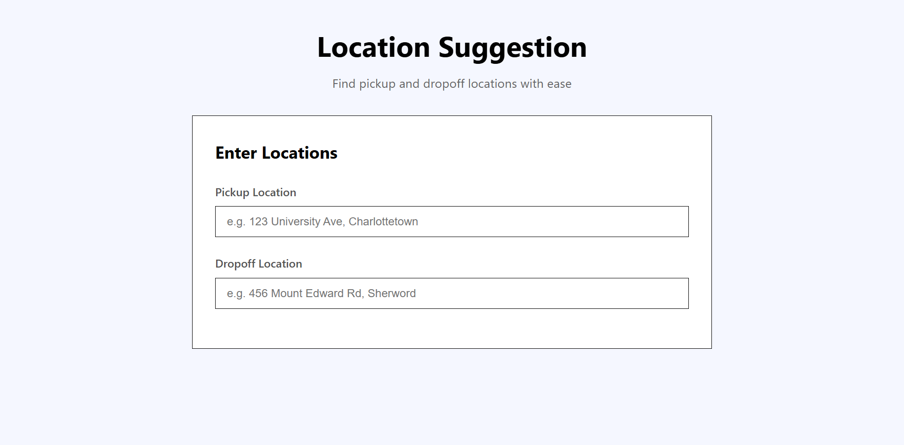

# Location Suggestions

A lightweight JavaScript address autocomplete widget that uses the [Photon API](https://photon.komoot.io/) for geocoding and displays results with custom Bootstrap icons based on place type.
```
+-------------------------------------------------------------+
|   _                    _   _                                |
|  | |    ___   ___ __ _| |_(_) ___  _ __                     |
|  | |   / _ \ / __/ _` | __| |/ _ \| '_ \                    |
|  | |__| (_) | (_| (_| | |_| | (_) | | | |                   |
|  |_____\___/ \___\__,_|\__|_|\___/|_| |_|                   |
|  / ___| _   _  __ _  __ _  ___  ___| |_(_) ___  _ __  ___   |
|  \___ \| | | |/ _` |/ _` |/ _ \/ __| __| |/ _ \| '_ \/ __|  |
|   ___) | |_| | (_| | (_| |  __/\__ \ |_| | (_) | | | \__ \  |
|  |____/ \__,_|\__, |\__, |\___||___/\__|_|\___/|_| |_|___/  |
|               |___/ |___/                                   |
|                                             adnans.website  |
+-------------------------------------------------------------+
```
Preview:


---

## ✨ Features
- Real-time address search from Photon API
- Icons for different place types (restaurants, houses, hotels, etc.)
- Click-to-fill suggestions
- PEI-restricted search area (customizable)
- Simple HTML/CSS/JS — no frameworks required

---

## 📦 Installation

1. **Download** or **clone** the repository:
   ```bash
   git clone https://github.com/adddeveloper/location-suggestions.git
